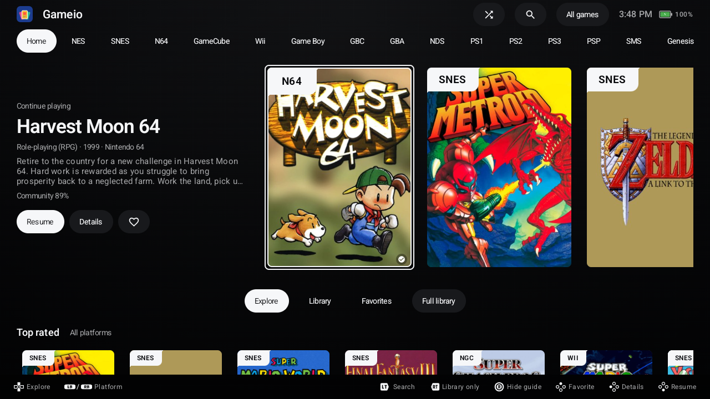
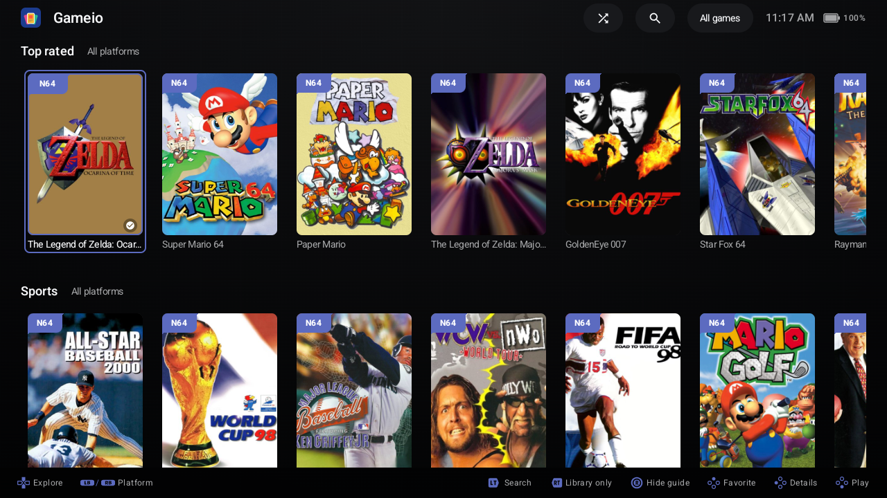
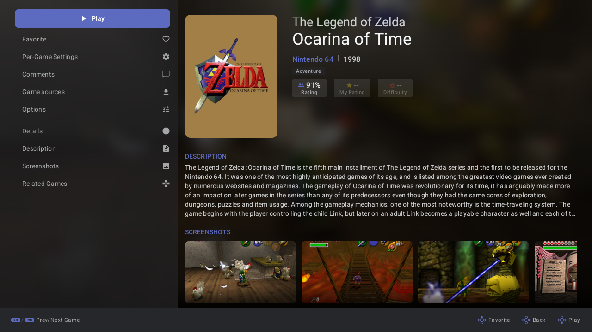

# Gameio

**Stremio for games.** Explore the whole library of every system you love, and let add-ons find the files.

[](LICENSE)
[](https://developer.android.com/about/versions/oreo)



Gameio is a controller-first Android launcher for handhelds. Instead of starting from the files you already have, it starts from the games: every system you follow shows its full catalog, with covers, descriptions, ratings and trailers, whether or not a game is on your device.

Like Stremio does for movies, Gameio doesn't host any games. **Add-ons** supply the download links. When you open a game, each add-on you've imported is asked where that game can be downloaded, and Gameio fetches it from there.

| Explore | Game page |
|---|---|
|  |  |

## How it works

1. **Create an account** in the app, or sign in if you have one. Then pick your systems, and home fills with every game the catalog knows for them.
2. **Import an add-on**, a small JSON file, during setup or under **Settings → Add-ons → Import add-on**.
3. **Open any game.** Gameio lists the sources your add-ons found. Pick one, and it downloads, verifies and launches with your emulator.
4. **Already have games?** Put them in your platform folders and Gameio shows them alongside the catalog.

## Add-ons

Two sample add-ons are ready to import. Download one on your device, then import it in Gameio:

| Add-on | Games | Needs |
|---|---|---|
| [Internet Archive](https://addons.playgameio.com/gameio-archive.json) | 3,076 | nothing |
| [Minerva, RetroAchievements](https://addons.playgameio.com/gameio-minerva-ra.json) | 5,862 | your own Real-Debrid account |

These are samples; a real add-on can be far larger. Most games behind the Real-Debrid one are not cached there yet, so the first download of a game waits while Real-Debrid fetches it.

**Make your own:** read the [add-on guide](docs/addon-format.md). The [gameio-addons](https://github.com/Gameioproject/gameio-addons) repo has the build and validation tools and a Claude skill that walks you through it.

Add-on sources can be direct HTTPS links, Internet Archive files, or single files inside torrents. Torrents are resolved through your own Real-Debrid account.

## Features

- Browse, search and filter the full catalog per system, and discover top-rated and hidden games
- Favorites, recently played and collections
- Save sync across devices with your Gameio account
- Comments on game pages, with replies and likes
- Emulator auto-detection, built-in cores, RetroAchievements, dual-screen support
- Fully usable with a gamepad, and touch-friendly too

### The look

Focus is a light source, not an outline: the selected item glows in the colours of its own cover art, tiles tilt towards where you came from, and a shine sweeps across covers like light on a cartridge. The backdrop drifts slowly behind it all, and home shows the artwork of whatever you are on. **Settings → Interface** keeps the controls: background artwork and cover previews, cover glow and box-art effects, and CRT **Scanlines**, which ship off.

## Get it

Download the latest APK from **[playgameio.com](https://playgameio.com)**. It runs on Android 8.0 and up and is designed for handhelds such as Retroid, AYN Odin and Anbernic devices. Gameio needs a Gameio account and the emulators for the systems you play.

Android may warn that the app comes from outside the Play Store; that is Play Protect reacting to any APK installed directly, not to something found in this one.

## Build

```bash
./gradlew :app:assembleDebug
```

## Credits and license

Gameio is a fork of [Argosy](https://github.com/nendotools/argosy-launcher) and is licensed under the [GNU GPL v3](LICENSE).
