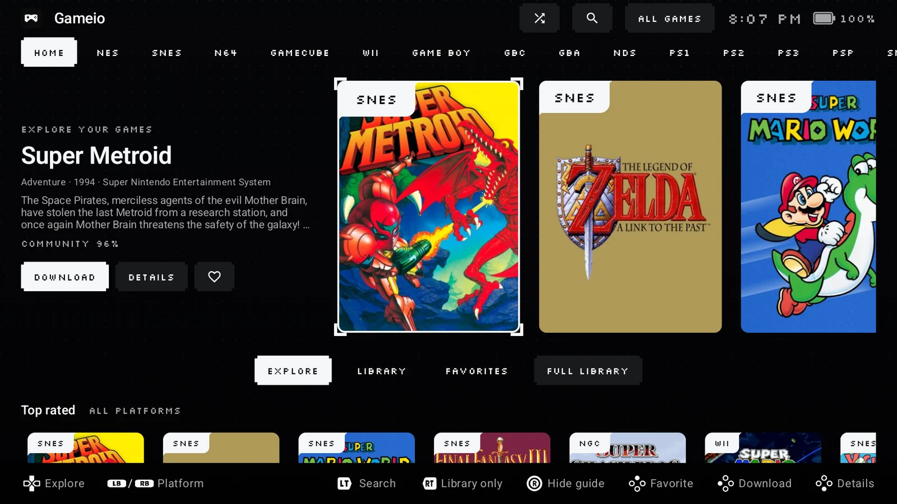
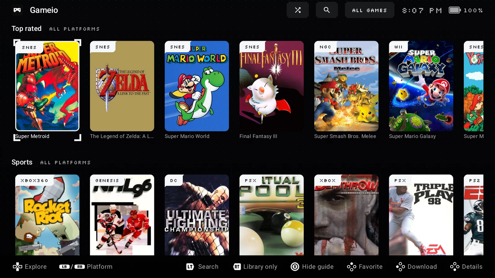
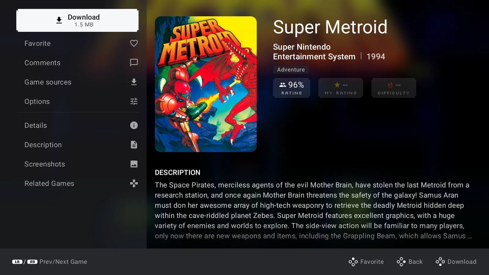

# Gameio

**[Download it at playgameio.com](https://playgameio.com)**

Gameio is a game launcher for Android handhelds, built to be driven with a controller. Think of it as Stremio for games: you pick the systems you care about, and Gameio shows you every game made for them, with covers, descriptions, ratings and trailers, whether or not it's on your device yet.

Gameio doesn't host any games itself. Add-ons do the finding. When you open a game, each add-on you've imported is asked where it can be downloaded, and Gameio takes it from there: download, check, launch.

## Getting started

Install the APK from [playgameio.com](https://playgameio.com). You'll need Android 8.0 or newer, a Gameio account, and the emulators for the systems you want to play. It's made for devices like Retroid, AYN Odin and Anbernic, and works fine with touch too.

Sign in, choose your systems, and your home screen fills up with their full catalogs. Then import an add-on, either during setup or later under **Settings → Add-ons**. After that, open any game and pick a source. If you already have games on your device, drop them into your platform folders and they'll show up alongside everything else.

Android may warn you that the app didn't come from the Play Store. That's Play Protect reacting to any directly installed APK, not to anything it found in this one.

## Add-ons

Two sample add-ons are ready to try:

- [Internet Archive](https://addons.playgameio.com/gameio-archive.json), about 3,000 games, no account needed
- [Minerva, RetroAchievements](https://addons.playgameio.com/gameio-minerva-ra.json), about 5,900 games, needs your own Real-Debrid account

With the Real-Debrid one, most games aren't cached yet, so the first download of a game can take a while as Real-Debrid fetches it.

An add-on is just a small JSON file pointing at direct links, Internet Archive files or files inside torrents (torrents go through your Real-Debrid account). If you want to make your own, start with the [add-on guide](docs/addon-format.md). The [gameio-addons](https://github.com/Gameioproject/gameio-addons) repo has the tools to build and check one.

## What else it does

Favorites, collections and recently played. Save sync between your devices. Comments on game pages. RetroAchievements, built-in cores, emulator auto-detection and dual-screen support.

It also tries to look nice. The game you're on glows in the colours of its own cover, tiles tilt as you move, and the background drifts behind whatever you're browsing. If that's too much, **Settings → Interface** lets you turn any of it down.

## Screenshots



| Explore | Game page |
|---|---|
|  |  |

## Building

```bash
./gradlew :app:assembleDebug
```

## Credits

Gameio is a fork of [Argosy](https://github.com/nendotools/argosy-launcher) and is licensed under the [GNU GPL v3](LICENSE).
